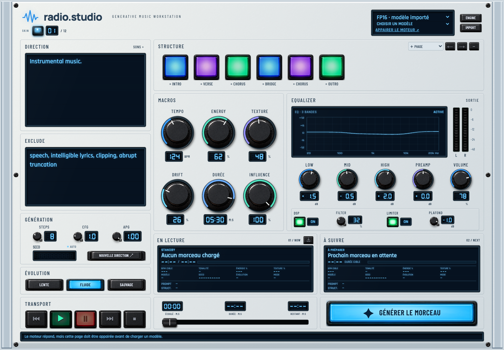

# Stable Audio Generative Radio

A browser-first generative radio player for Stable Audio 3 through a local inference engine.

Import a local `.safetensors` adapter, describe the sound in the Direction LCD, and let the radio prepare the next track. Each generation retains the complete description, including punctuation and line breaks. Seeds and non-tempo controls can evolve; the selected BPM remains the target. Playback, queueing, monitoring DSP, noise filtering, and limiting run in the browser.



## Run locally

```bash
npm install
npm run dev
```

Open the local Vite URL shown in the terminal, or `/generative-radio.html` to keep the explicit radio route. The development server proxies `/api` to the On Us Local Engine at `http://127.0.0.1:17846`.

On the radio page, authorize the local engine once. The pairing token is kept in this browser so an installed model does not need to be imported again after a reload. If the browser blocks the request, click the connection action from the page and allow local-network access, then retry.

The browser client expects a local Stable Audio 3 API exposing:

- `GET /api/stable-audio/radio/sfts`
- `POST /api/stable-audio/radio/sfts`
- `POST /api/stable-audio/radio/generations`
- `GET /api/stable-audio/radio/generations/:id`
- `GET /api/stable-audio/radio/generations/:id/audio`

To use another local API origin, copy `.env.example` to `.env` and set `VITE_RADIO_API_URL`. When the local-engine pairing token exists, requests go directly to the paired loopback engine and include the token; generated audio and model files remain local.

## Writing a direction

Follow the [official Stable Audio 3 prompt guide](https://kb.stability.ai/knowledge-base/stable-audio-3-prompt-guide): describe the style, instruments, rhythm, mood and recording character in plain English. For example:

> An intimate jazz trio with piano, upright bass and brushed drums. A gentle swing with short improvised phrases and a dry room sound.

The sound browser offers optional vocabulary across acoustic, orchestral, electronic and other styles. It does not depend on a particular fine-tune. Documented fields such as `TrackType: Music`, `TrackType: Instrument`, `TrackType: SFX`, `Format: Duo` and `Genre: Jazz` can also be written directly. They are optional; the client does not insert or rewrite them automatically.

Direction and Exclude are continuous text fields, with no tag splitting, pinning or random selection. Exclude is sent separately as `negative_prompt`, and the tempo control is sent as `bpm`. Selected structure phases append a natural-language arrangement sentence, preserving order and repetitions; they are descriptive guidance, not exact timed section commands. Existing pinned phrases are migrated into the visible Direction text once.

Edits wait for the next available generation slot. Playing audio, an in-flight request and the buffered next track remain intact.

The local engine determines which model variants can actually run; a shared prompt format does not add new model loaders.

## Scope

This repository contains only the standalone player. It does not include model weights, generated audio, credentials, or user data. Inference remains local through the On Us Local Engine API; the generated WAV is fetched into the browser for playback and is not sent to a cloud service by this client.

## Checks

```bash
npm test
npm run build
```

## Model

[Stable Audio 3 Medium on Hugging Face](https://huggingface.co/stabilityai/stable-audio-3-medium)

## License

MIT
